# DeepMemo File Formats Reference

**Version:** 1.0
**Last updated:** 2026-01-02

This document describes all file formats used by DeepMemo for data export and import. These specifications enable external tools (including AI assistants like Claude) to generate DeepMemo-compatible data files.

---

## Table of Contents

1. [Data Structure Overview](#data-structure-overview)
2. [ZIP Archive Format](#zip-archive-format)
3. [FreeMind .mm Format](#freemind-mm-format)
4. [Mermaid SVG Format](#mermaid-svg-format)
5. [IndexedDB Structure](#indexeddb-structure)
6. [Examples](#examples)

---

## Data Structure Overview

### Node Object

Every node in DeepMemo has the following structure:

```json
{
  "id": "node_1735820000123_abc",
  "title": "Node Title",
  "content": "Markdown content...",
  "type": "note",
  "parent": "parent_node_id",
  "children": ["child1_id", "child2_id"],
  "tags": ["tag1", "tag2"],
  "attachments": [
    {
      "id": "attach_1735820000456_xyz",
      "name": "document.pdf",
      "type": "application/pdf",
      "size": 1234567
    }
  ],
  "created": 1735820000000,
  "modified": 1735820000000
}
```

#### Node Fields

- **id** (string, required): Unique identifier, format `node_timestamp_random`
- **title** (string, required): Node title/name
- **content** (string, optional): Markdown content
- **type** (string, required): Either `"note"` or `"symlink"`
- **parent** (string|null, required): Parent node ID, or `null` for root nodes
- **children** (array, required): Array of child node IDs
- **tags** (array, optional): Array of tag strings
- **attachments** (array, optional): Array of attachment objects (see below)
- **created** (number, required): Unix timestamp (milliseconds)
- **modified** (number, required): Unix timestamp (milliseconds)

#### Symlink Nodes

Symlinks have additional fields:

```json
{
  "id": "symlink_1735820000123_abc",
  "title": "Custom Symlink Title",
  "type": "symlink",
  "targetId": "target_node_id",
  "parent": "parent_id",
  "children": [],
  "created": 1735820000000,
  "modified": 1735820000000
}
```

**Important**:
- Symlinks can have a **custom title** different from their target
- The `title` is stored on the symlink itself, not inherited from target
- Symlinks typically have no `content` or `children`
- `targetId` points to the actual node

#### Attachment Objects

⚠️ **CRITICAL**: Attachments MUST be an array of objects, NOT strings!

```json
{
  "id": "attach_1735820000456_xyz",
  "name": "document.pdf",
  "type": "application/pdf",
  "size": 1234567
}
```

- **id** (string): Unique attachment ID, format `attach_timestamp_random`
- **name** (string): Original filename with extension
- **type** (string): MIME type (e.g., `"image/png"`, `"application/pdf"`)
- **size** (number): File size in bytes

---

## ZIP Archive Format

DeepMemo uses ZIP archives for complete data export/import with attachments.

### File Structure

```
deepmemo-export-1735820000000.zip
├── data.json                 # Main data file
└── attachments/              # Attachments folder
    ├── attach_123_file1.pdf
    ├── attach_456_image.png
    └── ...
```

### Global Export ZIP

A **global export** includes ALL data and attachments.

#### `data.json` (Global)

```json
{
  "nodes": {
    "node_1": { ... },
    "node_2": { ... }
  },
  "rootNodes": ["node_1", "node_3"]
}
```

**Structure**:
- **nodes** (object): Dictionary of all nodes, keyed by node ID
- **rootNodes** (array): Array of root-level node IDs

#### Attachments Folder

Each attachment file is named: `{attachmentId}_{originalName}`

Example: `attach_1735820000456_xyz_document.pdf`

### Branch Export ZIP

A **branch export** includes only a specific subtree with its attachments.

#### `data.json` (Branch)

```json
{
  "type": "deepmemo-branch",
  "version": "1.0",
  "branchRootId": "node_123",
  "exported": 1735820000000,
  "nodeCount": 42,
  "nodes": {
    "node_123": { ... },
    "node_124": { ... }
  }
}
```

**Structure**:
- **type** (string): Always `"deepmemo-branch"`
- **version** (string): Format version (currently `"1.0"`)
- **branchRootId** (string): ID of the root node of this branch
- **exported** (number): Unix timestamp (milliseconds)
- **nodeCount** (number): Number of nodes in this branch
- **nodes** (object): Dictionary of branch nodes only

**Important**: Branch exports do NOT include `rootNodes` array.

### Import Behavior

#### Global Import
- **Replaces ALL existing data**
- Node IDs are **preserved** (no regeneration)
- All attachments are restored with original IDs
- User must confirm (data will be lost!)

#### Branch Import
- **Merges** into existing data
- Node IDs are **regenerated** to avoid conflicts
- Attachment IDs are also regenerated
- Parent-child relationships are remapped
- Branch root becomes child of selected parent

---

## FreeMind .mm Format

**Export only** - DeepMemo can export to FreeMind/Freeplane mindmap format.

### File Structure

```xml
<?xml version="1.0" encoding="UTF-8"?>
<map version="1.0.1">
  <node TEXT="Root Node Title" ID="node_123">
    <richcontent TYPE="NOTE">
      <html>
        <head></head>
        <body>
          <p style="white-space: pre-wrap;">Node content here...</p>
        </body>
      </html>
    </richcontent>
    <node TEXT="Child Node" ID="node_456">
      <!-- Children recursively -->
    </node>
    <node TEXT="Symlink Node" ID="symlink_789" COLOR="#ff9900" STYLE="bubble">
      <arrowlink DESTINATION="node_target" COLOR="#ff9900" STARTARROW="None" ENDARROW="Default"/>
    </node>
  </node>
</map>
```

### Key Features

1. **Node attributes**:
   - `TEXT`: Node title (XML-escaped, **emojis removed**)
   - `ID`: Original DeepMemo node ID
   - `COLOR`: `"#ff9900"` for symlinks only
   - `STYLE`: `"bubble"` for symlinks only

2. **Content**: Stored in `<richcontent TYPE="NOTE">` (regular nodes only)

3. **Symlinks**:
   - Orange color and bubble style
   - `<arrowlink>` element pointing to target
   - No content or children exported

4. **Emoji handling**: All emojis are **removed** from titles for better compatibility

5. **Multiple roots**: If exporting multiple root nodes, a virtual root "DeepMemo" is created

### XML Escaping

Characters are escaped as follows:
- `&` → `&amp;`
- `<` → `&lt;`
- `>` → `&gt;`
- `"` → `&quot;`
- `'` → `&apos;`

---

## Mermaid SVG Format

**Export only** - DeepMemo can export to Mermaid mindmap syntax and render as SVG.

### Mermaid Syntax

```mermaid
mindmap
  root((Root Node Title))
    Child 1
      Grandchild 1
      Grandchild 2
    Child 2
    🔗 Symlink Node
```



### Key Features

1. **Root node**: Double parentheses `((title))`
2. **Indentation**: 2 spaces per level
3. **Symlinks**: Prefixed with `🔗` emoji
4. **No children for symlinks**: Prevents duplication

### Character Escaping

Mermaid syntax is fragile. Characters are escaped/replaced:
- `()[]{}` → spaces
- `"` → `'`
- Newlines → spaces
- Multiple spaces → single space

### Rendering

- Uses [Mermaid.js](https://mermaid.js.org/) v10+ (loaded via CDN)
- Exported as SVG file (vector graphics)
- Fully rendered, ready for viewing

---

## IndexedDB Structure

DeepMemo stores attachment files in IndexedDB (not localStorage).

### Database Name

`deepmemo-attachments`

### Object Store

**Name**: `files`
**Key**: `id` (attachment ID)

### Stored Object

```javascript
{
  id: "attach_1735820000456_xyz",  // Primary key
  blob: Blob                        // Binary file data
}
```

**Important**: Only the blob is stored in IndexedDB. Metadata (name, type, size) is stored in the node's `attachments` array.

### Access Pattern

1. Read node from localStorage → get attachment metadata
2. Use attachment ID to fetch blob from IndexedDB
3. Combine metadata + blob for display/download

---

## Examples

### Example 1: Simple Branch Export

A minimal branch with 2 nodes:

```json
{
  "type": "deepmemo-branch",
  "version": "1.0",
  "branchRootId": "node_abc",
  "exported": 1735820000000,
  "nodeCount": 2,
  "nodes": {
    "node_abc": {
      "id": "node_abc",
      "title": "Tutorial",
      "content": "# Getting Started\n\nWelcome to DeepMemo!",
      "type": "note",
      "parent": null,
      "children": ["node_def"],
      "tags": ["tutorial"],
      "created": 1735820000000,
      "modified": 1735820000000
    },
    "node_def": {
      "id": "node_def",
      "title": "Step 1",
      "content": "First, create a node...",
      "type": "note",
      "parent": "node_abc",
      "children": [],
      "tags": [],
      "created": 1735820000000,
      "modified": 1735820000000
    }
  }
}
```

### Example 2: Branch with Symlink

```json
{
  "type": "deepmemo-branch",
  "version": "1.0",
  "branchRootId": "node_root",
  "exported": 1735820000000,
  "nodeCount": 3,
  "nodes": {
    "node_root": {
      "id": "node_root",
      "title": "Project",
      "type": "note",
      "parent": null,
      "children": ["node_task", "symlink_ref"],
      "created": 1735820000000,
      "modified": 1735820000000
    },
    "node_task": {
      "id": "node_task",
      "title": "Task List",
      "content": "- [ ] Item 1\n- [ ] Item 2",
      "type": "note",
      "parent": "node_root",
      "children": [],
      "created": 1735820000000,
      "modified": 1735820000000
    },
    "symlink_ref": {
      "id": "symlink_ref",
      "title": "Quick Reference",
      "type": "symlink",
      "targetId": "node_task",
      "parent": "node_root",
      "children": [],
      "created": 1735820000000,
      "modified": 1735820000000
    }
  }
}
```

### Example 3: Node with Attachments

```json
{
  "id": "node_docs",
  "title": "Documentation",
  "content": "See attached files for details.",
  "type": "note",
  "parent": null,
  "children": [],
  "tags": ["docs"],
  "attachments": [
    {
      "id": "attach_123_abc",
      "name": "specification.pdf",
      "type": "application/pdf",
      "size": 524288
    },
    {
      "id": "attach_456_def",
      "name": "diagram.png",
      "type": "image/png",
      "size": 102400
    }
  ],
  "created": 1735820000000,
  "modified": 1735820000000
}
```

**Corresponding ZIP structure**:
```
deepmemo-branch-Documentation-1735820000000.zip
├── data.json
└── attachments/
    ├── attach_123_abc_specification.pdf
    └── attach_456_def_diagram.png
```

---

## Generating DeepMemo Files with AI

### For Claude AI Projects

To generate a DeepMemo branch import file:

1. **Create the JSON structure** following the branch format
2. **Generate unique IDs**: Use format `node_{timestamp}_{random}`
3. **Set correct timestamps**: Unix milliseconds
4. **Build parent-child relationships**: Ensure bidirectional consistency
5. **Validate JSON**: Must be valid JSON with proper escaping
6. **Save as `.json` file**: User can import via DeepMemo UI

### Quick Generation Template

```json
{
  "type": "deepmemo-branch",
  "version": "1.0",
  "branchRootId": "node_{TIMESTAMP}_{RANDOM}",
  "exported": {CURRENT_TIMESTAMP},
  "nodeCount": {COUNT},
  "nodes": {
    "node_{TIMESTAMP}_{RANDOM}": {
      "id": "node_{TIMESTAMP}_{RANDOM}",
      "title": "Your Title Here",
      "content": "Your markdown content here...",
      "type": "note",
      "parent": null,
      "children": [],
      "tags": [],
      "created": {CURRENT_TIMESTAMP},
      "modified": {CURRENT_TIMESTAMP}
    }
  }
}
```

### Best Practices

1. **Use realistic timestamps**: Current Unix time in milliseconds
2. **Consistent parent-child links**: If A is parent of B, B must have A in children
3. **Unique IDs**: Never reuse IDs, even across different exports
4. **Valid Markdown**: Content field supports full CommonMark spec
5. **Optional fields**: Only include tags/attachments if needed
6. **Symlink targets**: Ensure targetId points to a node in the same export

---

## Version History

- **1.0** (2026-01-02): Initial specification
  - ZIP archive format (global + branch)
  - FreeMind .mm export
  - Mermaid SVG export
  - IndexedDB structure
  - Complete data model documentation

---

## See Also

- [SPEC-ATTACHMENTS.md](SPEC-ATTACHMENTS.md) - Detailed attachment system specification
- [SPEC-ATTACHMENTS-FR.md](SPEC-ATTACHMENTS-FR.md) - Spécification du système de pièces jointes
- [README.md](../README.md) - Main project documentation
