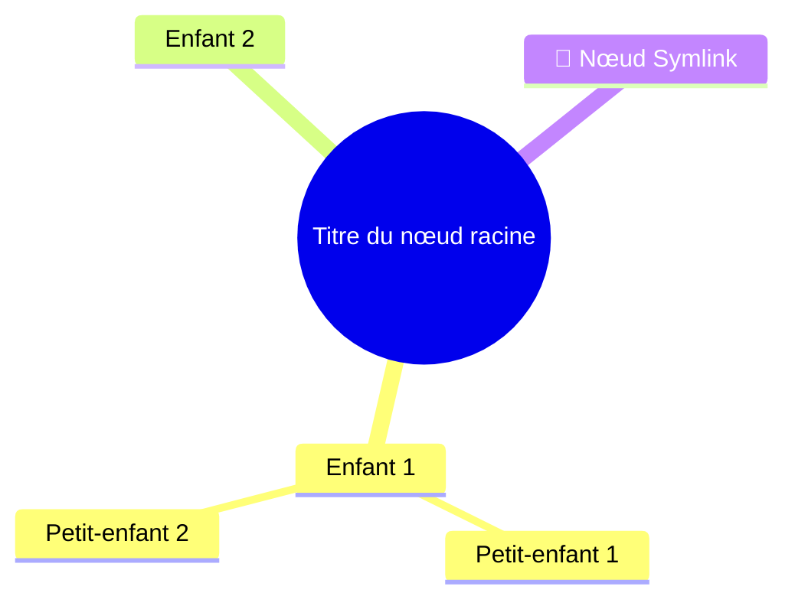

# Référence des Formats de Fichiers DeepMemo

**Version :** 1.0
**Dernière mise à jour :** 2026-01-02

Ce document décrit tous les formats de fichiers utilisés par DeepMemo pour l'export et l'import de données. Ces spécifications permettent aux outils externes (y compris les assistants IA comme Claude) de générer des fichiers compatibles avec DeepMemo.

---

## Table des Matières

1. [Vue d'ensemble de la structure de données](#vue-densemble-de-la-structure-de-données)
2. [Format Archive ZIP](#format-archive-zip)
3. [Format FreeMind .mm](#format-freemind-mm)
4. [Format Mermaid SVG](#format-mermaid-svg)
5. [Structure IndexedDB](#structure-indexeddb)
6. [Exemples](#exemples)

---

## Vue d'ensemble de la structure de données

### Objet Node (Nœud)

Chaque nœud dans DeepMemo a la structure suivante :

```json
{
  "id": "node_1735820000123_abc",
  "title": "Titre du nœud",
  "content": "Contenu en markdown...",
  "type": "note",
  "parent": "parent_node_id",
  "children": ["child1_id", "child2_id"],
  "tags": ["tag1", "tag2"],
  "attachments": [
    {
      "id": "attach_1735820000456_xyz",
      "name": "document.pdf",
      "type": "application/pdf",
      "size": 1234567
    }
  ],
  "created": 1735820000000,
  "modified": 1735820000000
}
```

#### Champs d'un nœud

- **id** (string, requis) : Identifiant unique, format `node_timestamp_random`
- **title** (string, requis) : Titre/nom du nœud
- **content** (string, optionnel) : Contenu en Markdown
- **type** (string, requis) : Soit `"note"` soit `"symlink"`
- **parent** (string|null, requis) : ID du nœud parent, ou `null` pour les nœuds racines
- **children** (array, requis) : Tableau des IDs des nœuds enfants
- **tags** (array, optionnel) : Tableau de chaînes de caractères (tags)
- **attachments** (array, optionnel) : Tableau d'objets pièces jointes (voir ci-dessous)
- **created** (number, requis) : Timestamp Unix (millisecondes)
- **modified** (number, requis) : Timestamp Unix (millisecondes)

#### Nœuds Symlink

Les symlinks ont des champs additionnels :

```json
{
  "id": "symlink_1735820000123_abc",
  "title": "Titre personnalisé du Symlink",
  "type": "symlink",
  "targetId": "target_node_id",
  "parent": "parent_id",
  "children": [],
  "created": 1735820000000,
  "modified": 1735820000000
}
```

**Important** :
- Les symlinks peuvent avoir un **titre personnalisé** différent de leur cible
- Le `title` est stocké sur le symlink lui-même, pas hérité de la cible
- Les symlinks n'ont typiquement pas de `content` ou de `children`
- `targetId` pointe vers le nœud réel

#### Objets Attachment (Pièce jointe)

⚠️ **CRITIQUE** : Les attachments DOIVENT être un tableau d'objets, PAS de chaînes de caractères !

```json
{
  "id": "attach_1735820000456_xyz",
  "name": "document.pdf",
  "type": "application/pdf",
  "size": 1234567
}
```

- **id** (string) : ID unique de la pièce jointe, format `attach_timestamp_random`
- **name** (string) : Nom de fichier original avec extension
- **type** (string) : Type MIME (ex: `"image/png"`, `"application/pdf"`)
- **size** (number) : Taille du fichier en octets

---

## Format Archive ZIP

DeepMemo utilise des archives ZIP pour l'export/import complet avec pièces jointes.

### Structure de fichiers

```
deepmemo-export-1735820000000.zip
├── data.json                 # Fichier de données principal
└── attachments/              # Dossier des pièces jointes
    ├── attach_123_file1.pdf
    ├── attach_456_image.png
    └── ...
```

### Export Global ZIP

Un **export global** inclut TOUTES les données et pièces jointes.

#### `data.json` (Global)

```json
{
  "nodes": {
    "node_1": { ... },
    "node_2": { ... }
  },
  "rootNodes": ["node_1", "node_3"]
}
```

**Structure** :
- **nodes** (objet) : Dictionnaire de tous les nœuds, indexés par ID de nœud
- **rootNodes** (array) : Tableau des IDs des nœuds racines

#### Dossier Attachments

Chaque fichier joint est nommé : `{attachmentId}_{nomOriginal}`

Exemple : `attach_1735820000456_xyz_document.pdf`

### Export Branche ZIP

Un **export de branche** inclut uniquement un sous-arbre spécifique avec ses pièces jointes.

#### `data.json` (Branche)

```json
{
  "type": "deepmemo-branch",
  "version": "1.0",
  "branchRootId": "node_123",
  "exported": 1735820000000,
  "nodeCount": 42,
  "nodes": {
    "node_123": { ... },
    "node_124": { ... }
  }
}
```

**Structure** :
- **type** (string) : Toujours `"deepmemo-branch"`
- **version** (string) : Version du format (actuellement `"1.0"`)
- **branchRootId** (string) : ID du nœud racine de cette branche
- **exported** (number) : Timestamp Unix (millisecondes)
- **nodeCount** (number) : Nombre de nœuds dans cette branche
- **nodes** (objet) : Dictionnaire des nœuds de la branche uniquement

**Important** : Les exports de branche n'incluent PAS le tableau `rootNodes`.

### Comportement à l'import

#### Import Global
- **Remplace TOUTES les données existantes**
- Les IDs de nœuds sont **préservés** (pas de régénération)
- Toutes les pièces jointes sont restaurées avec leurs IDs originaux
- L'utilisateur doit confirmer (les données seront perdues !)

#### Import Branche
- **Fusionne** avec les données existantes
- Les IDs de nœuds sont **régénérés** pour éviter les conflits
- Les IDs de pièces jointes sont également régénérés
- Les relations parent-enfant sont remappées
- La racine de la branche devient enfant du parent sélectionné

---

## Format FreeMind .mm

**Export uniquement** - DeepMemo peut exporter au format mindmap FreeMind/Freeplane.

### Structure de fichier

```xml
<?xml version="1.0" encoding="UTF-8"?>
<map version="1.0.1">
  <node TEXT="Titre du nœud racine" ID="node_123">
    <richcontent TYPE="NOTE">
      <html>
        <head></head>
        <body>
          <p style="white-space: pre-wrap;">Contenu du nœud ici...</p>
        </body>
      </html>
    </richcontent>
    <node TEXT="Nœud enfant" ID="node_456">
      <!-- Enfants récursivement -->
    </node>
    <node TEXT="Nœud Symlink" ID="symlink_789" COLOR="#ff9900" STYLE="bubble">
      <arrowlink DESTINATION="node_target" COLOR="#ff9900" STARTARROW="None" ENDARROW="Default"/>
    </node>
  </node>
</map>
```

### Caractéristiques principales

1. **Attributs de nœud** :
   - `TEXT` : Titre du nœud (échappé XML, **emojis supprimés**)
   - `ID` : ID DeepMemo original du nœud
   - `COLOR` : `"#ff9900"` pour les symlinks uniquement
   - `STYLE` : `"bubble"` pour les symlinks uniquement

2. **Contenu** : Stocké dans `<richcontent TYPE="NOTE">` (nœuds normaux uniquement)

3. **Symlinks** :
   - Couleur orange et style bulle
   - Élément `<arrowlink>` pointant vers la cible
   - Pas de contenu ou d'enfants exportés

4. **Gestion des emojis** : Tous les emojis sont **supprimés** des titres pour une meilleure compatibilité

5. **Racines multiples** : Si plusieurs nœuds racines sont exportés, une racine virtuelle "DeepMemo" est créée

### Échappement XML

Les caractères sont échappés comme suit :
- `&` → `&amp;`
- `<` → `&lt;`
- `>` → `&gt;`
- `"` → `&quot;`
- `'` → `&apos;`

---

## Format Mermaid SVG

**Export uniquement** - DeepMemo peut exporter en syntaxe mindmap Mermaid et générer un SVG.

### Syntaxe Mermaid



### Caractéristiques principales

1. **Nœud racine** : Double parenthèses `((titre))`
2. **Indentation** : 2 espaces par niveau
3. **Symlinks** : Préfixés avec l'emoji `🔗`
4. **Pas d'enfants pour les symlinks** : Évite la duplication

### Échappement de caractères

La syntaxe Mermaid est fragile. Les caractères sont échappés/remplacés :
- `()[]{}` → espaces
- `"` → `'`
- Retours à la ligne → espaces
- Espaces multiples → espace unique

### Rendu

- Utilise [Mermaid.js](https://mermaid.js.org/) v10+ (chargé via CDN)
- Exporté comme fichier SVG (graphique vectoriel)
- Entièrement rendu, prêt à visualiser

---

## Structure IndexedDB

DeepMemo stocke les fichiers joints dans IndexedDB (pas dans localStorage).

### Nom de la base de données

`deepmemo-attachments`

### Object Store

**Nom** : `files`
**Clé** : `id` (ID de la pièce jointe)

### Objet stocké

```javascript
{
  id: "attach_1735820000456_xyz",  // Clé primaire
  blob: Blob                        // Données binaires du fichier
}
```

**Important** : Seul le blob est stocké dans IndexedDB. Les métadonnées (nom, type, taille) sont stockées dans le tableau `attachments` du nœud.

### Modèle d'accès

1. Lire le nœud depuis localStorage → obtenir les métadonnées de la pièce jointe
2. Utiliser l'ID de la pièce jointe pour récupérer le blob depuis IndexedDB
3. Combiner métadonnées + blob pour l'affichage/téléchargement

---

## Exemples

### Exemple 1 : Export de branche simple

Une branche minimale avec 2 nœuds :

```json
{
  "type": "deepmemo-branch",
  "version": "1.0",
  "branchRootId": "node_abc",
  "exported": 1735820000000,
  "nodeCount": 2,
  "nodes": {
    "node_abc": {
      "id": "node_abc",
      "title": "Tutoriel",
      "content": "# Démarrage\n\nBienvenue dans DeepMemo !",
      "type": "note",
      "parent": null,
      "children": ["node_def"],
      "tags": ["tutoriel"],
      "created": 1735820000000,
      "modified": 1735820000000
    },
    "node_def": {
      "id": "node_def",
      "title": "Étape 1",
      "content": "D'abord, créez un nœud...",
      "type": "note",
      "parent": "node_abc",
      "children": [],
      "tags": [],
      "created": 1735820000000,
      "modified": 1735820000000
    }
  }
}
```

### Exemple 2 : Branche avec Symlink

```json
{
  "type": "deepmemo-branch",
  "version": "1.0",
  "branchRootId": "node_root",
  "exported": 1735820000000,
  "nodeCount": 3,
  "nodes": {
    "node_root": {
      "id": "node_root",
      "title": "Projet",
      "type": "note",
      "parent": null,
      "children": ["node_task", "symlink_ref"],
      "created": 1735820000000,
      "modified": 1735820000000
    },
    "node_task": {
      "id": "node_task",
      "title": "Liste de tâches",
      "content": "- [ ] Tâche 1\n- [ ] Tâche 2",
      "type": "note",
      "parent": "node_root",
      "children": [],
      "created": 1735820000000,
      "modified": 1735820000000
    },
    "symlink_ref": {
      "id": "symlink_ref",
      "title": "Référence rapide",
      "type": "symlink",
      "targetId": "node_task",
      "parent": "node_root",
      "children": [],
      "created": 1735820000000,
      "modified": 1735820000000
    }
  }
}
```

### Exemple 3 : Nœud avec pièces jointes

```json
{
  "id": "node_docs",
  "title": "Documentation",
  "content": "Voir les fichiers joints pour les détails.",
  "type": "note",
  "parent": null,
  "children": [],
  "tags": ["docs"],
  "attachments": [
    {
      "id": "attach_123_abc",
      "name": "specification.pdf",
      "type": "application/pdf",
      "size": 524288
    },
    {
      "id": "attach_456_def",
      "name": "diagramme.png",
      "type": "image/png",
      "size": 102400
    }
  ],
  "created": 1735820000000,
  "modified": 1735820000000
}
```

**Structure ZIP correspondante** :
```
deepmemo-branch-Documentation-1735820000000.zip
├── data.json
└── attachments/
    ├── attach_123_abc_specification.pdf
    └── attach_456_def_diagramme.png
```

---

## Générer des fichiers DeepMemo avec l'IA

### Pour Claude AI Projects

Pour générer un fichier d'import de branche DeepMemo :

1. **Créer la structure JSON** en suivant le format de branche
2. **Générer des IDs uniques** : Utiliser le format `node_{timestamp}_{random}`
3. **Définir des timestamps corrects** : Unix en millisecondes
4. **Construire les relations parent-enfant** : Assurer la cohérence bidirectionnelle
5. **Valider le JSON** : Doit être du JSON valide avec échappement approprié
6. **Sauvegarder comme fichier `.json`** : L'utilisateur peut importer via l'interface DeepMemo

### Template de génération rapide

```json
{
  "type": "deepmemo-branch",
  "version": "1.0",
  "branchRootId": "node_{TIMESTAMP}_{RANDOM}",
  "exported": {CURRENT_TIMESTAMP},
  "nodeCount": {COUNT},
  "nodes": {
    "node_{TIMESTAMP}_{RANDOM}": {
      "id": "node_{TIMESTAMP}_{RANDOM}",
      "title": "Votre titre ici",
      "content": "Votre contenu markdown ici...",
      "type": "note",
      "parent": null,
      "children": [],
      "tags": [],
      "created": {CURRENT_TIMESTAMP},
      "modified": {CURRENT_TIMESTAMP}
    }
  }
}
```

### Bonnes pratiques

1. **Utiliser des timestamps réalistes** : Temps Unix actuel en millisecondes
2. **Liens parent-enfant cohérents** : Si A est parent de B, B doit avoir A dans ses enfants
3. **IDs uniques** : Ne jamais réutiliser des IDs, même entre différents exports
4. **Markdown valide** : Le champ content supporte la spec CommonMark complète
5. **Champs optionnels** : N'inclure tags/attachments que si nécessaire
6. **Cibles de symlinks** : S'assurer que targetId pointe vers un nœud du même export

---

## Historique des versions

- **1.0** (2026-01-02) : Spécification initiale
  - Format archive ZIP (global + branche)
  - Export FreeMind .mm
  - Export Mermaid SVG
  - Structure IndexedDB
  - Documentation complète du modèle de données

---

## Voir aussi

- [SPEC-ATTACHMENTS-FR.md](SPEC-ATTACHMENTS-FR.md) - Spécification détaillée du système de pièces jointes
- [SPEC-ATTACHMENTS.md](SPEC-ATTACHMENTS.md) - Detailed attachment system specification
- [README-FR.md](../README-FR.md) - Documentation principale du projet
