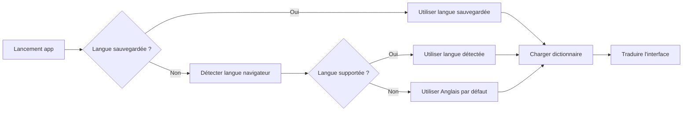

# Internationalisation (i18n)

> Guide complet du système multilingue de DeepMemo
>
> **Version** : V0.10.5
> **Mise à jour** : 2026-01-29

---

## Table des Matières

1. [Vue d'ensemble](#vue-densemble)
2. [Langues supportées](#langues-supportées)
3. [Changer la langue de l'interface](#changer-la-langue-de-linterface)
4. [Détection automatique](#détection-automatique)
5. [Persistance des préférences](#persistance-des-préférences)
6. [Éléments traduits](#éléments-traduits)
7. [Manifests PWA bilingues](#manifests-pwa-bilingues)
8. [Pour les contributeurs : Ajouter une nouvelle langue](#pour-les-contributeurs--ajouter-une-nouvelle-langue)
9. [Architecture technique](#architecture-technique)

---

## Vue d'ensemble

DeepMemo est une **application bilingue** disponible en **Français** et **Anglais**. L'interface s'adapte automatiquement à la langue de votre navigateur, et vous pouvez changer de langue à tout moment.

### Caractéristiques principales

| Fonctionnalité | Description |
|----------------|-------------|
| **🌍 Langues supportées** | Français (FR) et Anglais (EN) |
| **🔍 Détection automatique** | Détecte la langue du navigateur au premier lancement |
| **💾 Persistance** | Votre choix est sauvegardé dans le navigateur |
| **⚡ Changement instantané** | L'interface se traduit en temps réel sans rechargement |
| **📱 PWA multilingue** | Nom et description de l'application adaptés par langue |

📍 **Référence** : `src/js/utils/i18n.js:1-13` (documentation du module)

---

## Langues supportées

DeepMemo supporte actuellement **2 langues** :

| Code | Langue | Fichier de traduction | Nombre de clés |
|------|--------|----------------------|----------------|
| **fr** | Français | `src/js/locales/fr.js` | 298 traductions |
| **en** | English | `src/js/locales/en.js` | 298 traductions |

📍 **Référence** : `src/js/utils/i18n.js:22` (constante `SUPPORTED_LANGS`)

### Langue par défaut

Si votre navigateur utilise une langue non supportée (ex: Espagnol, Allemand), DeepMemo bascule automatiquement en **Anglais**.

📍 **Référence** : `src/js/utils/i18n.js:20-21` (constantes `DEFAULT_LANG` et `FALLBACK_LANG`)

---

## Changer la langue de l'interface

### Méthode 1 : Via le panneau d'informations

1. **Ouvrir le panneau d'informations** (cliquer sur le bouton **ℹ️** en haut à droite)
2. Défiler jusqu'à la section **"Preferences"**
3. Cliquer sur le bouton de la langue souhaitée :
   - **🇫🇷 Français**
   - **🇬🇧 English**
4. L'interface se traduit **instantanément**

📍 **Référence UI** : Panneau d'informations (généré dynamiquement)
📍 **Référence code** : `src/js/features/editor.js:731-760` (génération panneau préférences)

### Méthode 2 : Programmatique (pour développeurs)

```javascript
// Changer la langue vers l'anglais
await app.changeLanguage('en');

// Changer la langue vers le français
await app.changeLanguage('fr');
```

📍 **Référence** : `src/js/app.js:1584-1590` (fonction `changeLanguage`)

---

## Détection automatique

Au **premier lancement**, DeepMemo détecte automatiquement la langue de votre navigateur.

### Processus de détection



**Algorithme de détection** :

1. Lire la propriété `navigator.language` du navigateur (ex: `"fr-FR"`, `"en-US"`)
2. Extraire le code langue (ex: `"fr"`, `"en"`)
3. Vérifier si cette langue est supportée
4. Sinon, utiliser la langue par défaut (Anglais)

📍 **Référence** : `src/js/utils/i18n.js:28-31` (fonction `detectLanguage`)

### Exemples de détection

| Langue du navigateur | Langue détectée | Raison |
|---------------------|----------------|--------|
| `fr-FR` (Français France) | **Français** | Langue supportée |
| `fr-CA` (Français Canada) | **Français** | Langue supportée (code `fr`) |
| `en-US` (Anglais USA) | **Anglais** | Langue supportée |
| `en-GB` (Anglais UK) | **Anglais** | Langue supportée (code `en`) |
| `es-ES` (Espagnol) | **Anglais** | Langue non supportée → fallback |
| `de-DE` (Allemand) | **Anglais** | Langue non supportée → fallback |

---

## Persistance des préférences

Votre choix de langue est **automatiquement sauvegardé** dans le navigateur et restauré lors de vos prochaines visites.

### Stockage

La langue est sauvegardée dans `localStorage` sous la clé `deepmemo_lang` :

```javascript
// Exemple de sauvegarde
localStorage.setItem('deepmemo_lang', 'fr');  // Sauvegarde Français
localStorage.setItem('deepmemo_lang', 'en');  // Sauvegarde Anglais
```

📍 **Référence** : `src/js/utils/i18n.js:19` (constante `STORAGE_KEY`)
📍 **Référence** : `src/js/utils/i18n.js:178` (sauvegarde lors du changement)

### Restauration au lancement

Au lancement de l'application :

1. Vérifier si une langue est sauvegardée dans `localStorage`
2. **Si oui** : utiliser la langue sauvegardée
3. **Si non** : détecter la langue du navigateur

📍 **Référence** : `src/js/utils/i18n.js:106-124` (fonction `initI18n`)

---

## Éléments traduits

### 1. Interface statique (HTML)

Tous les éléments de l'interface HTML sont traduits via des attributs `data-i18n-*` :

| Attribut | Usage | Exemple |
|----------|-------|---------|
| `data-i18n` | Traduit le **texte** de l'élément | `<button data-i18n="actions.save">Save</button>` |
| `data-i18n-placeholder` | Traduit le **placeholder** d'un input | `<input data-i18n-placeholder="placeholders.search">` |
| `data-i18n-title` | Traduit le **title** (infobulle) | `<button data-i18n-title="tooltips.copyNodeUrl">` |
| `data-i18n-content` | Traduit l'attribut **content** (meta tags) | `<meta data-i18n-content="meta.description">` |
| `data-i18n-aria-label` | Traduit l'attribut **aria-label** | `<button data-i18n-aria-label="actions.close">` |

📍 **Référence** : `src/js/utils/i18n.js:220-261` (fonction `translateDOM`)

**Exemple dans l'HTML** :

```html
<!-- Bouton "Nouveau nœud" -->
<button id="newRootNodeBtn" class="btn"
        data-i18n="actions.newNode"
        onclick="app.createRootNode()">
  ➕ Nouveau nœud
</button>
```

📍 **Référence UI** : `index.html:124`

Au chargement, le texte est remplacé par la traduction correspondante :
- **FR** : "Nouveau nœud"
- **EN** : "New node"

### 2. Interface dynamique (JavaScript)

Les textes générés dynamiquement utilisent la fonction `t(key, params)` :

```javascript
// Exemple : notification toast
showToast(t('toast.saved'), '✅');
// FR: "Sauvegardé"
// EN: "Saved"
```

📍 **Référence** : `src/js/utils/i18n.js:137-156` (fonction `t`)

### 3. Messages avec variables

Le système supporte l'**interpolation de variables** :

```javascript
// Exemple : compteur de nœuds
t('app.nodeCounter', { count: 5 })
// FR: "5 nœuds"
// EN: "5 nodes"
```

**Définition dans le dictionnaire** :

```javascript
// src/js/locales/fr.js
nodeCounter: "{count} nœud{{count > 1 ? 's' : ''}}"

// src/js/locales/en.js
nodeCounter: "{count} node{{count > 1 ? 's' : ''}}"
```

📍 **Référence FR** : `src/js/locales/fr.js:19`
📍 **Référence EN** : `src/js/locales/en.js:11`

**Syntaxe d'interpolation** :

- `{variable}` : Remplace par la valeur de la variable
- `{{expression}}` : Évalue une expression JavaScript (pour les pluriels, conditions)

📍 **Référence** : `src/js/utils/i18n.js:77-98` (fonction `interpolate`)

### 4. Messages pluralisés

DeepMemo gère automatiquement les pluriels :

```javascript
t('storage.filesCount', { count: 1 })  // "1 attached file"
t('storage.filesCount', { count: 5 })  // "5 attached files"
```

**Dictionnaire** :

```javascript
filesCount: "{count} attached file{{count > 1 ? 's' : ''}}"
```

L'expression `{{count > 1 ? 's' : ''}}` ajoute un "s" si `count > 1`.

📍 **Référence EN** : `src/js/locales/en.js:366`
📍 **Référence FR** : `src/js/locales/fr.js:379`

---

## Manifests PWA bilingues

DeepMemo génère **deux manifests PWA** différents selon la langue :

| Langue | Fichier manifest | Nom de l'app |
|--------|------------------|--------------|
| **Français** | `manifest-fr.json` | "DeepMemo - Ton second cerveau" |
| **Anglais** | `manifest-en.json` | "DeepMemo - Your second brain" |

📍 **Référence** : `manifest-fr.json:2` (nom français)
📍 **Référence** : `manifest-en.json:2` (nom anglais)

### Sélection du manifest

Le manifest approprié est chargé **au lancement de l'application** via un script dans `index.html` :

```javascript
// Sélection du manifest selon la langue
const savedLang = localStorage.getItem('deepmemo_language');
const browserLang = navigator.language.toLowerCase().startsWith('fr') ? 'fr' : 'en';
const lang = savedLang || browserLang;
const manifestHref = lang === 'en' ? 'manifest-en.json' : 'manifest-fr.json';

// Mise à jour du manifest
document.getElementById('app-manifest').href = manifestHref;
```

📍 **Référence** : `index.html:77-91` (script de sélection manifest)

**Conséquence** : Lorsque vous installez DeepMemo comme PWA, le nom affiché sur votre écran d'accueil correspond à votre langue :

- **FR** : "DeepMemo - Ton second cerveau" 🇫🇷
- **EN** : "DeepMemo - Your second brain" 🇬🇧

---

## Pour les contributeurs : Ajouter une nouvelle langue

Si vous souhaitez ajouter une nouvelle langue (ex: Espagnol, Allemand), voici les étapes :

### 1. Créer le fichier de dictionnaire

Créer un nouveau fichier `src/js/locales/[code].js` (ex: `es.js` pour l'espagnol) en copiant la structure de `fr.js` ou `en.js`.

**Structure du dictionnaire** :

```javascript
/**
 * DeepMemo - [Langue] Dictionary
 * Complete translation of all UI strings
 */

export default {
  app: {
    title: "DeepMemo",
    tagline: "Votre traduction ici",
    nodeCounter: "{count} nœud{{count > 1 ? 's' : ''}}"
  },

  actions: {
    newNode: "Traduction...",
    // ... ~350 clés à traduire
  },

  // Voir src/js/locales/en.js pour la liste complète
};
```

📍 **Référence modèle** : `src/js/locales/en.js:1-426` (structure complète)

### 2. Ajouter la langue à la liste supportée

Modifier `src/js/utils/i18n.js` :

```javascript
const SUPPORTED_LANGS = ['fr', 'en', 'es'];  // Ajouter 'es'
```

📍 **Référence** : `src/js/utils/i18n.js:22`

### 3. Créer le manifest PWA

Créer `manifest-es.json` en copiant `manifest-en.json` et traduire les champs :

```json
{
  "name": "DeepMemo - Tu segundo cerebro",
  "short_name": "DeepMemo",
  "description": "Sistema de gestión del conocimiento...",
  "lang": "es",
  // ... autres champs
}
```

### 4. Mettre à jour le sélecteur de manifest

Modifier le script dans `index.html` (ligne 78-90) pour supporter la nouvelle langue.

### 5. Ajouter le bouton dans l'interface

Ajouter un bouton dans le panneau d'informations pour permettre de sélectionner la nouvelle langue.

---

## Architecture technique

### Système léger sans dépendances

DeepMemo utilise un **système i18n maison** sans bibliothèque externe (pas de `react-i18next`, `vue-i18n`, etc.).

**Avantages** :
- ✅ **Léger** : ~260 lignes de code seulement
- ✅ **Rapide** : Pas de dépendance à charger
- ✅ **Flexible** : Adapté aux besoins spécifiques de DeepMemo
- ✅ **Complet** : Supporte variables, pluriels, fallback

📍 **Référence** : `src/js/utils/i18n.js` (262 lignes)

### Chargement lazy des dictionnaires

Les dictionnaires sont chargés **à la demande** (lazy loading) pour optimiser les performances :

```javascript
// Import dynamique
const module = await import(`../locales/${lang}.js`);
dictionaries[lang] = module.default;
```

**Avantage** : Au lancement, seul le dictionnaire de la langue active est chargé (~15 KB), pas les deux.

📍 **Référence** : `src/js/utils/i18n.js:37-54` (fonction `loadDictionary`)

### Fallback en cascade

Si une clé de traduction est manquante, le système utilise un **fallback en cascade** :

1. Chercher dans la langue courante (ex: Français)
2. Si manquant → Chercher dans la langue de fallback (Anglais)
3. Si toujours manquant → Afficher `[key]` pour débogage

```javascript
// Exemple si "toast.nouveauMessage" n'existe qu'en français
t('toast.nouveauMessage')  // FR: "Nouveau message"
t('toast.nouveauMessage')  // EN: "Nouveau message" (fallback vers FR)
```

📍 **Référence** : `src/js/utils/i18n.js:145-156` (logique de fallback)

### Parcours de clés imbriquées (dot notation)

Les clés de traduction utilisent la **notation à points** pour organiser les traductions :

```javascript
t('modals.export.zip.title')  // "Archive ZIP"
```

Correspond à la structure :

```javascript
{
  modals: {
    export: {
      zip: {
        title: "Archive ZIP"
      }
    }
  }
}
```

📍 **Référence** : `src/js/utils/i18n.js:62-64` (fonction `getNestedValue`)

### Initialisation au lancement

L'initialisation se fait en **3 étapes** :

```javascript
// 1. Détection ou restauration de la langue
const savedLang = localStorage.getItem('deepmemo_lang');
currentLang = savedLang || detectLanguage();

// 2. Chargement du dictionnaire
await loadDictionary(currentLang);

// 3. Traduction du DOM
translateDOM();
```

📍 **Référence** : `src/js/utils/i18n.js:106-124` (fonction `initI18n`)
📍 **Référence** : `src/js/app.js:44` (appel au lancement de l'app)

### Re-traduction lors du changement de langue

Lorsque l'utilisateur change de langue, DeepMemo :

1. Charge le nouveau dictionnaire (si pas déjà chargé)
2. Met à jour la variable `currentLang`
3. Sauvegarde dans `localStorage`
4. **Re-traduit tout le DOM** en appelant `translateDOM()`
5. **Re-rend les composants dynamiques** (arbre, éditeur, panneau)

```javascript
export async function setLanguage(lang) {
  await loadDictionary(lang);
  currentLang = lang;
  localStorage.setItem('deepmemo_lang', lang);

  translateDOM();  // Re-traduit HTML statique

  if (window.app && window.app.render) {
    window.app.render();  // Re-rend l'arbre
    // Re-affiche le nœud courant
    EditorModule.displayNode(window.app.currentNodeId, ...);
  }
}
```

📍 **Référence** : `src/js/utils/i18n.js:167-201` (fonction `setLanguage`)

---

## Statistiques

### Éléments traduits dans l'interface

| Catégorie | Nombre de clés | Exemples |
|-----------|----------------|----------|
| **Actions** | 18 | Boutons (Nouveau, Sauvegarder, Exporter...) |
| **Toasts** | 73 | Notifications (Sauvegardé, Erreur...) |
| **Alertes** | 7 | Messages d'erreur |
| **Confirmations** | 6 | Dialogues de confirmation |
| **Modals** | ~80 | Titres et contenus des modales |
| **Placeholders** | 4 | Textes d'aide dans les inputs |
| **Labels** | 30 | Étiquettes (Créé, Modifié, Tags...) |
| **Types de nœuds** | 8 | Badges (Lien, Externe, Copie...) |
| **Messages** | 8 | Textes de bienvenue, états vides |
| **Tooltips** | 15 | Infobulles |
| **Raccourcis clavier** | 9 | Descriptions des raccourcis |
| **Stockage** | 6 | Section stockage |
| **PWA** | 4 | Métadonnées |
| **PDF** | 7 | Export PDF |
| **FS Sync** | 9 | Synchronisation système de fichiers |
| **Total** | **298** | Toutes les chaînes traduites |

### Utilisation dans l'interface HTML

| Attribut | Nombre d'utilisations | Usage |
|----------|----------------------|-------|
| `data-i18n` | 84 | Traduction de texte |
| `data-i18n-placeholder` | ~10 | Traduction de placeholders |
| `data-i18n-title` | ~15 | Traduction de tooltips |
| `data-i18n-content` | 4 | Traduction de meta tags |
| **Total** | **~113** | Éléments HTML traduits |

📍 **Référence** : `index.html` (84 occurrences de `data-i18n`)

---

## Exemples d'utilisation

### Exemple 1 : Message simple

```javascript
// Code
showToast(t('toast.saved'), '✅');

// Résultat
// FR: "✅ Sauvegardé"
// EN: "✅ Saved"
```

### Exemple 2 : Message avec variable

```javascript
// Code
showToast(t('toast.dataImported', { count: 42 }), '✅');

// Résultat
// FR: "✅ 42 nœud(s) importé(s)"
// EN: "✅ 42 node(s) imported"
```

### Exemple 3 : Pluriel automatique

```javascript
// Code
t('app.nodeCounter', { count: 1 })
t('app.nodeCounter', { count: 5 })

// Résultat
// FR: "1 nœud", "5 nœuds"
// EN: "1 node", "5 nodes"
```

### Exemple 4 : Traduction d'élément HTML

```html
<!-- HTML -->
<button data-i18n="actions.export">Export</button>

<!-- Après traduction (FR) -->
<button data-i18n="actions.export">Exporter</button>

<!-- Après traduction (EN) -->
<button data-i18n="actions.export">Export</button>
```

---

## Bonnes pratiques

### ✅ À faire

- **Utiliser des clés explicites** : `actions.save` plutôt que `btn1`
- **Grouper par contexte** : `modals.export.*`, `toast.*`
- **Tester les pluriels** : Vérifier avec `count = 0, 1, 2, 5`
- **Vérifier les deux langues** : S'assurer que FR et EN sont cohérents
- **Utiliser `data-i18n`** : Pour tous les textes statiques de l'HTML

### ❌ À éviter

- Mettre du texte en dur dans le JavaScript : ❌ `"Saved"` → ✅ `t('toast.saved')`
- Oublier de traduire les tooltips : Ajouter `data-i18n-title`
- Créer des clés manquantes : Vérifier que la clé existe dans les deux dictionnaires
- Utiliser des expressions complexes : Garder `{{...}}` simple (pluriels uniquement)

---

## Voir aussi

- [Guide complet des features](../4-FEATURES.md) - Toutes les fonctionnalités de DeepMemo
- [Architecture](../2-ARCHITECTURE.md) - Structure du projet

---

**Dernière mise à jour** : 2026-01-29 | **Version** : V0.10.5
